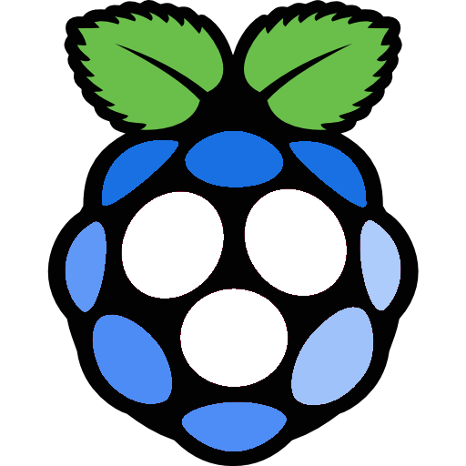

</img>

 

  

    <ul>
      
<h1 style="display: inline-block;">Blueberry PI</h1>

    </ul>
    A Chromium-powered kiosk designed to <i>function and feel</i> like
     purpose-built hardware
  

   

# Dependencies
`pi-gen`

# Building
> [!WARNING]
> BlueberryPI is designed to be built on a Debain-based system in accordance to [pi-gen](https://github.com/rpi-distro/pi-gen); the tool making this OS possible.
>
> If you do not have access to a Debain/Ubuntu system I would recommend using [Vagrant](https://github.com/hashicorp/vagrant) and running the respective build script `some/path/run_vagrant_build.sh`.
Alternativly you could build BlueberryPI inside of a VM using tools like VirtualBox, VMWare, QEMU, etc...

